# 💫 About Me:
Technical Artist for Hades team!

Currently working on Puzzle Solitaire

Previous projects:
  - Drop Merge (hiatus)
  - Hexa Swap (cancelled)
   
## 🌐 Socials:

# 💻 Tech Stack:

# 📊 GitHub Stats

  

  

  

## 🏆 Trophies

  

## 🔥 Contributions

  

